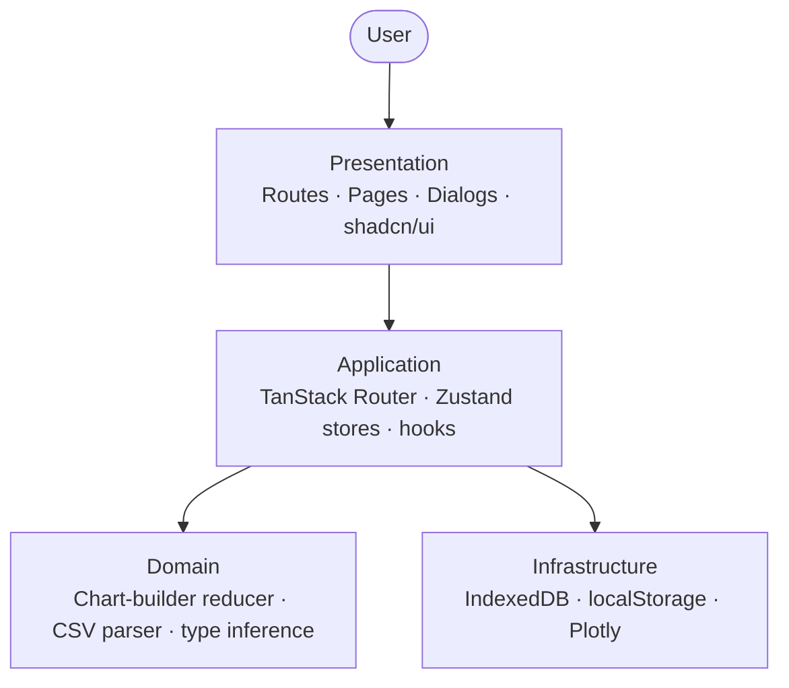

# InsightFlow — Architecture

A short walkthrough of the structure. Companion to `WRITEUP.md`. Visual system is documented at the `/styleguide` route.

---

## 1 · Overview

Four layers, drawn top-down. Each layer talks only to the one below it.



- **Presentation** — what the user sees. JSX, route files, dialogs, shadcn primitives.
- **Application** — how the app behaves. Routing, stores, hooks that wire state to UI.
- **Domain** — pure logic. The chart-builder reducer, CSV parsing, type inference — no React, no DOM, fully testable in isolation.
- **Infrastructure** — external dependencies. IndexedDB for persistence, localStorage for UI prefs, Plotly for rendering.

The app runs entirely in the browser — no backend layer, no server calls.

---

## 2 · Tech stack

| Layer | Choice | Why |
|---|---|---|
| Framework | React 19 + TypeScript | Brief requirement; strict mode catches integration issues at compile time. |
| Build | Vite 8 | Fast HMR, native ESM, minimal config. |
| Routing | TanStack Router | File-based, type-safe params, built-in view transitions and intent-preload. |
| State | Zustand | Small surface, pluggable persistence adapter. |
| Persistence | idb-keyval | 1 KB async key-value wrapper around IndexedDB. |
| Styling | Tailwind CSS v4 | Token-driven via `@theme inline`, dark mode via root class flip. |
| UI primitives | shadcn/ui (Radix) | Source-owned, a11y handled by Radix, customisable in place. |
| Combobox | cmdk | Searchable dropdowns for column and filter pickers. |
| Calendar | react-day-picker | Date-range picker for filters; avoids re-implementing range UX. |
| Charts | Plotly + react-plotly.js | Brief requirement. |
| Icons | lucide-react | Consistent stroke, tree-shakable. |
| Tests | Vitest | Same config as Vite; runs parser and reducer tests. |

---

## 3 · Repo organisation

### 3.1 · Root

```
insight-flow/
  .superpowers/        # writing-plans / executing-plans skill artefacts (specs, plans)
  docs/                # whitepaper, style guide, screen specs, submission docs, mockups
  public/              # static assets served as-is
  src/                 # application source (see 3.2)
  components.json      # shadcn/ui config
  eslint.config.js
  index.html           # Vite entry HTML
  package.json
  prettier.config.js
  README.md
  tsconfig.json        # strict mode
  tsconfig.node.json
  vite.config.ts       # define global, optimizeDeps for plotly
  vitest.config.ts
```

### 3.2 · `src/`

Feature-based. Each route keeps its private code next to it in a sibling `-name` folder (TanStack Router treats `-` folders as non-route).

```
src/
  main.tsx                       # router + StrictMode boot
  routeTree.gen.ts               # generated by @tanstack/router-plugin
  styles/globals.css             # tokens + typography utilities + view transitions

  routes/
    __root.tsx                   # outer layout, navigation grayscale
    index.tsx        ←   -home-page/
    datasources.tsx  ←   -data-sources-page/
                           data-source-table/
                           upload-data-source-dialog/
    reports/
      index.tsx      ←   -reports-page/
                           report-table/
                           add-report-dialog/
      $reportId.tsx  ←   -report-detail-page/
                           chart-builder-dialog/
                             chart-preview/
                             step-1-chart-type/
                             step-2-data/
                             step-3-filter/
                             step-4-style/
    styleguide.tsx   ←   -styleguide-page/

  shell/
    shell.tsx
    sidebar/
    toast-host/

  stores/
    data-sources.store.ts
    reports.store.ts
    theme.store.ts
    ui.store.ts
    toast.store.ts

  components/
    ui/                          # shadcn primitives (Button, Dialog, Popover, …)
    shared/                      # cross-page composites
      applied-filter-chips/
      confirm-dialog/
      filter-row/
      step-card/
      type-badge/

  lib/
    idb-storage.ts               # Zustand persist adapter over idb-keyval
    parsers/                     # CSV parser + type inference
    sample-data/                 # bundled demo CSV
    utils/cn.ts

  types/                         # shared domain types (DataSource, Report, Chart, …)
```

### 3.3 · Feature folder layout

Inside any feature folder the layout is the same:

```
<feature>/
  <feature>.tsx         # JSX, presentation
  <feature>.hook.ts     # state, handlers, derived values
  <feature>.type.ts     # local types
  <feature>.utils.ts    # pure helpers
  <feature>.utils.test.ts
  index.ts
  <child-feature>/      # nested if it grows
```

This separates *what the user sees* from *how it behaves* from *anything testable in isolation*. The same pattern repeats at every depth — when a route grows a dialog, the dialog uses the same layout; when a dialog grows steps, each step does too.

---

## 4 · State management

State is categorised by lifetime, not by domain:

| Kind | Lives in | Examples |
|---|---|---|
| Persistent (large) | IndexedDB via `idb-keyval` | `data-sources`, `reports` |
| Persistent (small) | localStorage | `theme`, `ui` (sidebar collapsed) |
| Ephemeral | In-memory | `toast`, dialog open/close |
| Derived | Computed in hooks | Chart traces, filtered rows, validity per step |

Each store is consumed by a different layer, so splitting them keeps re-renders scoped — toggling the sidebar doesn't re-render the chart preview.

A small adapter (`lib/idb-storage.ts`) wires Zustand's `persist` middleware to IndexedDB. The trade-off is async hydration — pages that depend on persisted data render a skeleton until `persist.hasHydrated()` returns true.

---

## 5 · Routing and styling

**Routing.** TanStack Router with file-based routes and `autoCodeSplitting`. Two settings shape navigation: `defaultViewTransition: true` (uses the browser View Transitions API for cross-fades on supported browsers) and `defaultPreload: 'intent'` (prefetches a route's code on hover/focus). A grayscale filter on the root element during navigation (`useRouterState({ select: s => s.isLoading })`) gives feedback when a fetch is in flight.

**Styling.** Design tokens (colour, radius, shadow, type scale) live as CSS custom properties in `globals.css`. Tailwind v4's `@theme inline` exposes them as utilities. Dark mode is a `.dark` class on the root that swaps variable values — no class duplication in components. The `/styleguide` route renders every token live so the spec and implementation can't drift.

---

## 6 · Performance and limits

- **Bundle.** Per-route code splitting via TanStack Router.
- **CSV parsing.** Runs on the main thread. CSVs above ~50 MB slow noticeably; the fix is moving the parser to a Web Worker.

---

## 7 · Testing

Tests cover the parts where bugs would silently produce wrong charts:

- CSV parser (`lib/csv/parse.test.ts`) — header detection, type inference.
- Chart-builder reducer (`chart-builder-reducer.test.ts`) — every state transition.
- Bucket-key generation (`chart-builder-dialog.utils.test.ts`) — sort order for line charts.

UI components are not unit-tested; the `/styleguide` route serves as the manual regression surface for visual changes.
