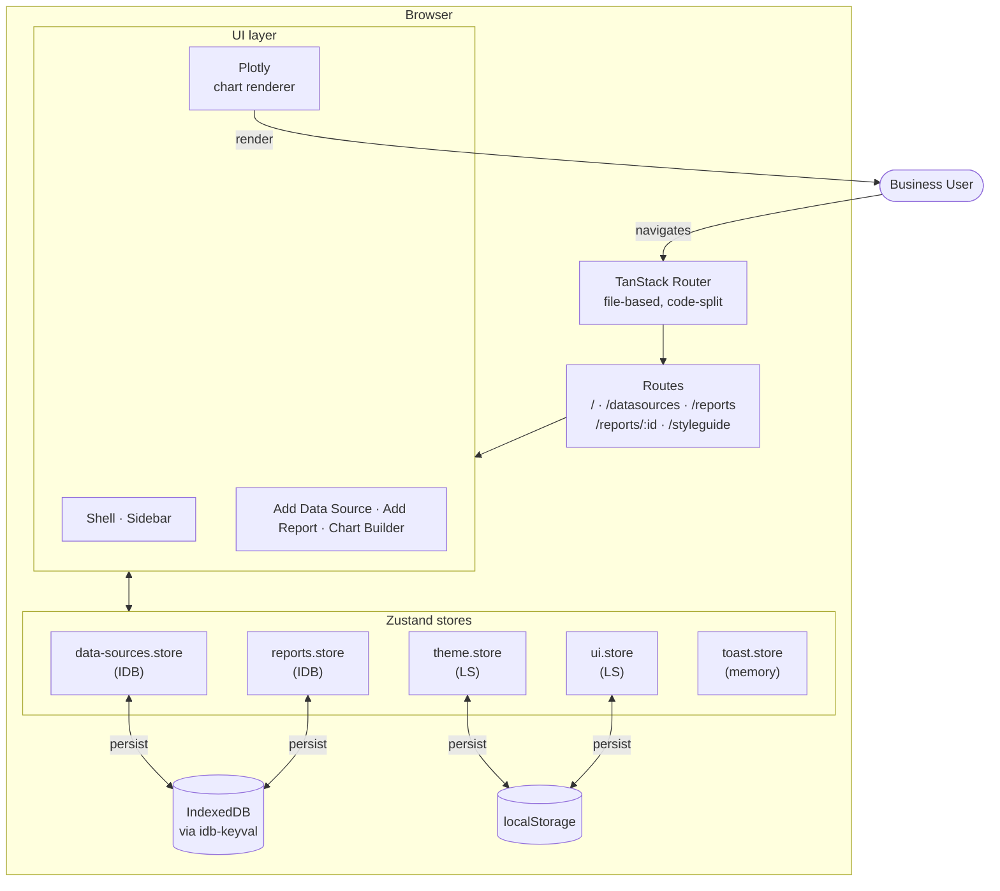
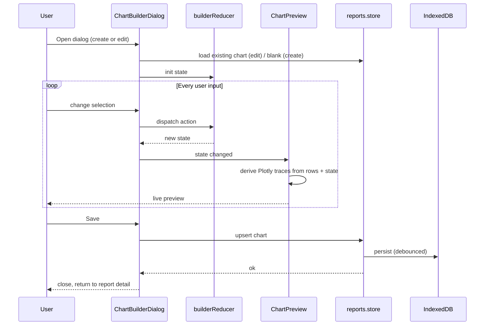

# InsightFlow — Architecture Walkthrough

**Companion to `WRITEUP.md`.** This doc covers component structure, state management, data flow, and scalability/cost considerations. The visual layer is documented separately in `docs/StyleGuide.md` and is rendered live at the `/styleguide` route.

---

## 1 · TL;DR

A single-page React app, no backend. State is split into five Zustand stores — two persisted to IndexedDB (the large data), three persisted to localStorage (the small UI state). Routing is file-based via TanStack Router with code-splitting per route and view-transitions for nav. The chart builder is the only complex piece; everything else is a thin shell around it.

Build cost in dollars/month: **$0**. Cost to render one chart: **0 server roundtrips** — Plotly draws client-side from in-memory rows.

---

## 2 · System diagram



---

## 3 · Stack choices and why

| Choice                                  | Why                                                                                                                                                                                                                                                                                     |
| --------------------------------------- | --------------------------------------------------------------------------------------------------------------------------------------------------------------------------------------------------------------------------------------------------------------------------------------- |
| **React 19 + TypeScript strict**        | Brief requirement; strict mode catches the integrations (Plotly's CJS shape, react-day-picker's classNames map) at compile time rather than runtime.                                                                                                                                    |
| **Vite 8**                              | Fast dev loop, native ESM, no webpack config. The one wrinkle (Plotly CJS interop) is documented in §6.                                                                                                                                                                                 |
| **TanStack Router**                     | File-based routing without Next-style server framework overhead. Auto code-splitting per route, built-in View Transitions integration, type-safe params. The alternative (React Router v7) would have needed manual code-splitting and lacks the `defaultPreload: 'intent'` ergonomics. |
| **Zustand**                             | Smallest viable state library — no providers, no boilerplate.                                                                                                                                                                                                                           |
| **Tailwind CSS v4 + `@theme inline`**   | Tokens defined once in CSS custom properties, exposed to utilities via `@theme`. Dark mode is a `.dark` class flip on the root that swaps CSS variable values — no class duplication in components.                                                                                     |
| **shadcn/ui primitives (Radix-backed)** | Used Shadcn components, they provide a list of excellent components , used this library becasue good developer expereince , most suitable for my application.                                                                                                                           |
| **Plotly + react-plotly.js**            | Brief requirement. Used eagerly (not lazy) — see WRITEUP §4. The CJS interop needs an unwrap function (see §6) but otherwise stock.                                                                                                                                                     |
| **idb-keyval**                          | The simplest async KV adapter for IndexedDB — 1 KB, no schema setup, returns Promises. Fits Zustand's async StateStorage shape with no glue.                                                                                                                                            |
| **cmdk + Radix Popover**                | The Combobox pattern (searchable dropdown) used in filter rows and column pickers.                                                                                                                                                                                                      |
| **react-day-picker v10**                | Calendar primitive for date-range filters. Picked over building one because date-range UX (keyboard nav, locale, range state) is a tar pit.                                                                                                                                             |
| **No state library for server data**    | Because there is no server. If a backend were added, TanStack Query would be the natural pairing.                                                                                                                                                                                       |

---

## 4 · Component structure

### 4.1 · Folder layout (under `src/`)

```
main.tsx              # router boot, StrictMode
routeTree.gen.ts      # generated by router plugin
styles/globals.css    # tokens + typography utilities + view-transitions

routes/               # one folder per route + hidden subpackages
  __root.tsx
  index.tsx              → -home-page/
  datasources.tsx        → -data-sources-page/
  reports/
    index.tsx            → -reports-page/
    $reportId.tsx        → -report-detail-page/
  styleguide.tsx         → -styleguide-page/

shell/                # frame around non-home routes
  shell.tsx
  sidebar/

stores/               # one file per Zustand slice
  data-sources.store.ts
  reports.store.ts
  theme.store.ts
  ui.store.ts
  toast.store.ts

components/
  ui/                 # shadcn primitives (Button, Dialog, Popover, …)
  shared/             # cross-page composites (Toast, FilterRow, …)

lib/
  idb-storage.ts      # Zustand persist adapter over idb-keyval
  utils/cn.ts
  csv/                # parser + type inference

types/                # shared domain types (DataSource, Report, Chart…)
```

### 4.2 · Co-location pattern

Every non-trivial component sits in its own folder with a fixed layout:

```
<feature>/
  <feature>.tsx         # JSX, presentation only
  <feature>.hook.ts     # state, handlers, derived values — "the view model"
  <feature>.type.ts     # local types (props, view-model shape)
  <feature>.utils.ts    # pure functions (testable)
  <feature>.utils.test.ts
  index.ts              # barrel
  <child-feature>/      # nested if it grows
```

**Why:** the JSX file stays small and readable; `<feature>.tsx` is for _what the user sees_, `<feature>.hook.ts` is for _how it behaves_, `<feature>.utils.ts` is for _anything that's testable in isolation_. Tests live next to the code they test (no separate `__tests__/` mirror tree).

The convention scales: when `report-detail-page` grew a chart-builder dialog, the dialog became its own folder with the same layout, and its four steps became four child folders with the same layout again. There is no special case anywhere — the same six-file pattern at every depth.

### 4.3 · The hidden-folder convention (`-name`)

TanStack Router treats folders prefixed with `-` as **non-route** subpackages. This is how I keep route-private code (hooks, utils, sub-components) physically next to the route file without polluting the URL tree. `routes/-report-detail-page/` is colocated with `routes/reports/$reportId.tsx` but isn't itself a route.

---

## 5 · State management

### 5.1 · Five stores, sliced by domain

| Store                | What                                          | Persistence        | Notes                                                                                                                                                                    |
| -------------------- | --------------------------------------------- | ------------------ | ------------------------------------------------------------------------------------------------------------------------------------------------------------------------ |
| `data-sources.store` | Uploaded files + parsed rows + column configs | **IndexedDB**      | Largest payload (a 10 MB CSV becomes ~20 MB of objects). Hydration is async — pages gate on `useDataSourcesStore.persist.hasHydrated()` and show a skeleton until ready. |
| `reports.store`      | Reports + their chart configs                 | **IndexedDB**      | Smaller than data-sources but follows the same async-hydration pattern for consistency.                                                                                  |
| `theme.store`        | `mode: 'light' \| 'dark'` + resolved value    | **localStorage**   | Sync hydration. Migration logic in `onRehydrateStorage` strips legacy `'system'` values.                                                                                 |
| `ui.store`           | `sidebarCollapsed`                            | **localStorage**   | Sync, tiny, never going to grow.                                                                                                                                         |
| `toast.store`        | Active toast queue                            | **In-memory only** | Toasts shouldn't survive a refresh.                                                                                                                                      |

### 5.2 · Why split rather than one root store

Each store is consumed by a different layer (data-sources by the upload flow and chart preview; reports by the list and detail pages; theme by every component via the body class). Splitting means:

- Re-renders are scoped — toggling the sidebar doesn't re-render the chart preview.
- Persistence keys are independent — I can wipe theme without touching reports.
- Storage backends can differ per store (IDB for big, LS for small). One root store can't do that.

### 5.3 · The IndexedDB adapter

`lib/idb-storage.ts` is a 12-line `StateStorage` impl wrapping `idb-keyval`:

```ts
export const idbStorage: StateStorage = {
  getItem: async (name) => (await get<string>(name)) ?? null,
  setItem: async (name, value) => {
    await set(name, value)
  },
  removeItem: async (name) => {
    await del(name)
  },
}
```

The chain is: store action → Zustand → persist middleware (debounced serialize) → adapter → idb-keyval → IndexedDB. The same store reads sync from memory on every render; the IDB write happens off the render path.

### 5.4 · Handling async hydration

IndexedDB reads are async, which means on a hard refresh the store is briefly empty. Three patterns handle this:

1. **Skeleton screens.** The data-sources table renders a `<DataSourceTableSkeleton />` while `!hasHydrated()`. Same for the report list.
2. **`onFinishHydration` for first-paint logic.** Anything that depends on persisted data subscribes via the hook, not the static selector.
3. **Route-level pending components.** `$reportId.tsx` registers a `pendingComponent: ReportDetailSkeleton` so navigation never shows a blank frame.

---

## 6 · Notable implementation details

### 6.1 · Plotly CJS interop

`react-plotly.js` ships as CJS and Vite's interop occasionally double-wraps the default export. Symptom: "Plot is not a function — got object." Fix is a defensive unwrap in `chart-preview.tsx`:

```ts
const unwrap = (m: unknown): unknown => {
  let cur = m
  for (let i = 0; i < 5; i += 1) {
    if (typeof cur === 'function') return cur
    if (cur && typeof cur === 'object' && 'default' in (cur as Record<string, unknown>)) {
      cur = (cur as { default: unknown }).default
    } else return cur
  }
  return cur
}
const Plot = unwrap(PlotMod) as ComponentType<Record<string, unknown>>
```

Plus `vite.config.ts`: `define: { global: 'globalThis' }` (Plotly references `global`) and `optimizeDeps.include: ['react-plotly.js']` (force pre-bundling so the CJS shape is resolved once at startup, not per HMR).

### 6.2 · View transitions + grayscale stale indicator

`__root.tsx` reads `useRouterState({ select: (s) => s.isLoading })` and applies `filter: grayscale(1) opacity(0.7)` to the page while a route is loading. Combined with `defaultViewTransition: true` and `defaultPreload: 'intent'`, navigation feels intentional — you see the current page fade to grayscale, then smoothly cross-fade to the new one. Browsers without View Transitions (Firefox, Safari) get a clean cross-fade instead.

### 6.3 · Chart-builder reducer

The four-step builder shares one reducer (`chart-builder-reducer.ts`) instead of letting each step own its piece of state. Validity per step is computed from the same state object, so cross-step rules (e.g. "Step 4 only enables when Step 2 is valid, regardless of whether Step 3 has been visited") are one selector — not a coordination problem between four components. The reducer has its own test file.

---

## 7 · Data flow — chart-builder example



The preview never round-trips to a store while the user is editing — the reducer is the source of truth, and `chart-preview.hook.ts` derives traces from `(rows, state)` pure-functionally. The store is written to only at Save.

---

## 8 · Scalability and cost considerations

### 8.1 · Where this scales fine

- **Number of data sources / reports:** IndexedDB has effectively unlimited browser quota for a single origin (usually 60% of free disk). 1000s of small reports are fine.
- **Number of components on a page:** code-splitting per route means each page boots only its dialog and chart code, not the whole app.
- **Persistence reads:** zero cost — local. No network, no server.

### 8.2 · Where this hits a wall (and what would change)

| Limit                                 | Hit at roughly        | What would change                                                                                                                                                                      |
| ------------------------------------- | --------------------- | -------------------------------------------------------------------------------------------------------------------------------------------------------------------------------------- |
| **CSV row count** in browser memory   | ~500k rows (~50 MB)   | Move parsing off the main thread (Web Worker), stream rather than `JSON.stringify`-ing the whole sheet. Already in the design — `data-sources.store` could read row-slices on demand.  |
| **Chart trace size**                  | ~50k points per trace | Plotly itself slows; the fix is server-side aggregation or pre-bucketing. The reducer already buckets time-series — extending this to "always sample beyond N points" is one selector. |
| **Concurrent users on the same data** | Day one               | Out of scope. Would need a backend (Supabase/Convex), a sync layer, and a permission model. The Zustand store shape doesn't need to change — `idbStorage` becomes `httpStorage`.       |
| **Cross-device persistence**          | Day one               | Same as above — the local-only model is a deliberate scope decision for the prototype.                                                                                                 |

### 8.3 · Cost model

- **Today: $0/month.** Static hosting (Vercel/Netlify free tier) is the only line item once deployed.
- **At 1k users uploading 10 MB CSVs each:** still $0 — data lives on the user's device.
- **At "shared dashboards" feature:** introduces a backend ($25-50/mo Postgres + $0-20/mo hosting on Fly/Railway for a few thousand users). The cost curve only bends if you start storing user data centrally.

The architecture deliberately defers infrastructure cost until there's a feature that requires it. A local-first prototype for a one-week brief is the right tradeoff; "local-first as a permanent stance" would also be defensible (cf. Linear's offline mode, Figma's local cache) and the codebase would barely change.

---

## 9 · Testing

Tests are tightly scoped per the project's policy (parsers + chart logic only):

- `chart-builder-reducer.test.ts` — every state transition.
- `chart-builder-dialog.utils.test.ts` — bucket key generation, axis label derivation.
- `lib/csv/parse.test.ts` — header detection, type inference, sample-row picking.

UI components are not unit-tested — the visual contract lives in the `/styleguide` route, which doubles as a manual regression surface. This is a conscious tradeoff: the chart math is where bugs hurt (silent wrong charts), so that's where tests live.

---

## 10 · What this architecture is not

This is **not** a production architecture. It's a prototype architecture optimized for: (a) one user at a time, (b) one week of build, (c) zero infrastructure cost, (d) a brief that's evaluating _thinking_, not throughput. Production would need: a backend, auth, multi-tenancy, server-side rendering for sharing, an aggregation layer, telemetry. The component structure and state shape are designed to _survive_ that transition (everything that knows about persistence is behind the `idbStorage` adapter), but the transition itself is not built.
